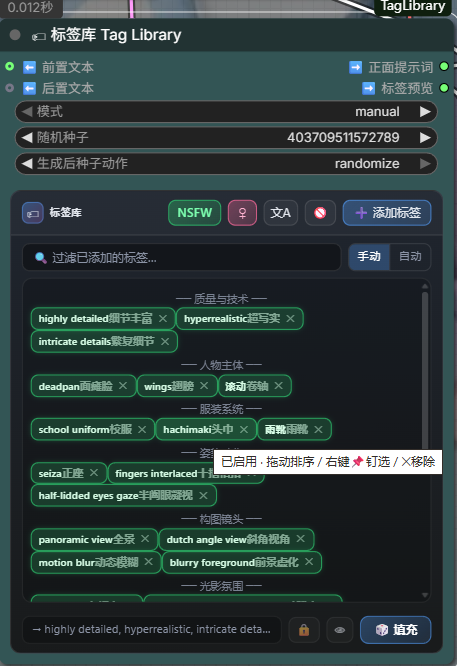
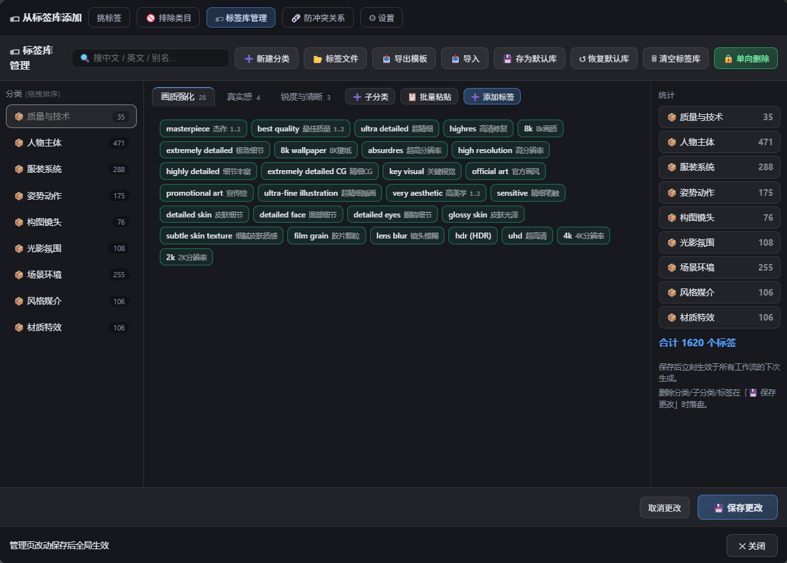

# 🏷 ComfyUI-TagLibrary

[中文文档](README.md) | **English**

Structured prompt tag library node for ComfyUI: in-node selection panel + standalone manager page +
dual-mode random engine + anti-conflict system + folder-based storage with hot sync.
Outputs plain `STRING` — just Convert to Input on any workflow's `CLIPTextEncode.text`. Runs in 1-4ms per generation.

  

## UI Preview

| Node panel (pick / grouped fill / NSFW toggle) | Library manager (CRUD / import-export / backups) |
|---|---|
|  |  |

## Features

- **In-node panel**: category-grouped chips, drag-to-reorder selected tags, 📌 pinning (always included in random),
  bilingual EN/中文 display, NSFW toggle
- **Two modes**
  - `Manual` — pick tags by hand, or 🎲 fill randomly with per-subcategory count ranges
  - `Auto` — every generation rolls a fresh combination by the rules; results echo back into the panel
    (same feel as a randomized seed)
- **➕ Add Tags picker (5 tabs)**: Pick Tags / Exclusions / Library Manager / Conflicts / Settings
- **Standalone manager page**: open `http://127.0.0.1:8188/taglib` directly, or use the 🏷 topbar button —
  full CRUD for categories/subcategories/tags (right-click rename/delete/reorder), chip-flow layout, NSFW red badges
- **NSFW tiers**: nudity/explicit tags shown in red, gated by a toggle for display and output; everything else unaffected
- **Anti-conflict system**: rule file with free import/export; mutual exclusion between any mix of
  tags / subcategories / categories — when random picks one side, the other side steps aside (manual picks unaffected)
- **Folder-based storage (hot sync)**: the library IS a folder tree, synced both ways with the manager page in real time
- **AI collaboration loop**: export templates (basic/full) + conflicts file, send to your AI to extend or restructure,
  import the result with auto-placement, dedupe and a confirm preview
- **Backup**: 💾 Save as Default / ↺ Restore Backup / 🗑 Clear Library (optionally exporting a full template first)
- **Pin semantics v1.1**: 📌 pinned tags are always included in random/fill, never overwritten, and occupy one slot of their subcategory; pins beat excluded categories
- **Gender filter**: ⚧/♀/♂ toggle to drop male-only or female-only tags by their gender flag
- **Data layout**: all plugin data nested under `data/default/` with English backup names (backups/factory_backup.json etc.), auto-migrated on upgrade
- **Performance**: 1-4ms per node execution; library reads cached, hot-sync scans throttled
- **Seed determinism**: same seed → same output; weight syntax `(tag:1.2)`, order-preserving dedupe, prefix/suffix concat

## Installation

### Option 1: ComfyUI Manager search (recommended)

1. Click the Manager icon in the top bar → **Custom Nodes Manager**
2. Search **`Tag Library`** (or `taglibrary`) → find "🏷 Tag Library 标签库" → **Install**
3. Restart ComfyUI when prompted

> If it doesn't show up, refresh the node database cache in Manager (or restart ComfyUI) and search again.

### Option 2: Install via Git URL

Manager → **Install via Git URL** → paste:
```
https://github.com/WSYXIUBA/ComfyUI-TagLibrary
```

### Option 3: Git clone

```bash
cd ComfyUI/custom_nodes
git clone https://github.com/WSYXIUBA/ComfyUI-TagLibrary
```

Restart ComfyUI. No pip dependencies.

## Quick Start

1. Double-click the canvas, search "🏷 标签库" (TagLibrary) and add the node
2. On a `CLIPTextEncode` node, right-click `text` → **Convert to Input** → connect the library's `positive`
3. Open **➕ Add Tags**: pick tags, set exclusions, manage the library, configure conflicts, tweak settings
4. `Manual` mode: select or 🎲 fill; `Auto` mode: just queue — every run rolls a new combination
5. Connect `tags_preview` to a Preview Text node to inspect the output

```
[🏷 TagLibrary] ──positive──▶ [CLIPTextEncode.text (converted)] ──▶ ...
     └─ tags_preview ──▶ [Preview Text]
```

## Node Interface

| Input/Output | Description |
|---|---|
| `mode` | Manual / Auto |
| `seed` | Random seed, deterministic per seed |
| `selection_state` | Panel state (managed automatically, don't hand-edit) |
| `prefix` / `suffix` (optional inputs) | Upstream text concatenated around the tags |
| `positive` output | Assembled prompt → CLIPTextEncode |
| `tags_preview` output | The actual content → Preview Text |

## Data Files

| File/Directory | Description |
|---|---|
| `data/tag_library.json` | Factory default library (ships with the plugin) |
| `data/tag_library.user.json` | User library snapshot (manager saves, with deletion tombstones; survives plugin updates) |
| `data/taglib/` | **Folder-based library** (bi-directional hot sync, see below); contains `conflicts.json` |
| `data/tagfiles/` | Legacy tag-file directory (still scanned for imports) |
| `data/备份库/` | Backup location for "💾 Save as Default" |

Deleting the user library resets to factory defaults (same as the Clear Library button).

## Folder-Based Library (Bi-directional Hot Sync)

```
data/taglib/
├── conflicts.json        ← anti-conflict rules
├── 质量与技术/            ← level-1 category = folder
│   ├── 画质强化/          ← level-2 category = subfolder
│   │   └── 画质强化.md    ← # category / ## subcategory heading + tag lines
│   └── 真实感/
└── 人物主体/ ...
```

- **Manager changes → folder**: adding/removing/renaming categories syncs the tree instantly on save
- **Folder → manager**: hand-edit a file (`english(Chinese){weight}[nsfw]`, comma separated), save,
  refresh the page and the tags appear — heading-less files are classified by their containing folder
- The `标签文件` dialog supports: tree browsing / per-file import / ⏩ import all / 📁 sync library to folder

## Anti-Conflict System

```jsonc
// data/taglib/conflicts.json
{ "rules": [
  { "id": "nude-vs-clothes",
    "left":  { "kind": "tags", "value": ["nude", "topless", "..."] },
    "right": [ { "kind": "sub", "value": "服装系统/上装" } ] }
]}
```

- **A rule = bi-directional exclusion**: when random fill / auto mode picks one side, the other side yields;
  manual selection is never blocked
- `kind` supports: `tag` single tag / `tags` multiple tags / `sub` subcategory / `cat` category
- **Three ways to configure**: ① right-click any tag / subcategory / category → 🧷 Conflict Settings
  (checkbox tree, saves instantly) ② the Conflicts tab in the picker lists all rules with add/delete
  ③ export the file and let an AI generate a new one
- **Invalid references auto-detected**: rules pointing at missing categories/tags are flagged in red
- Ships with default rules: nudity/swimwear ↔ tops/bottoms/suits (accessories like necklaces are fine);
  photorealistic ↔ anime style; legacy mutual-exclusion groups are migrated automatically

## AI Collaboration Loop

「📤 Export Template」 offers four choices: **Basic template** (skeleton + samples, for AI to generate new tag
files), **Full template** (every tag — extend it, restructure categories with Clear Library, or share your
library), **Conflicts file only**, **Conflicts + full template (two files)**.
Send the pair to your AI → it generates a new conflicts file per the embedded instructions →
「📥 Import」 with preview (auto-placement + dedupe + invalid markers) → confirm.

## Performance

Node execution measured at **1-4ms**. Library reads are cached; hot-sync folder scans are throttled
(1.5s min interval). Occasional hundred-ms attribution windows come from Python GIL contention with
other plugins' background threads (Manager registry updates, hardware pollers) — not this node's compute.

## Tests

```bash
python tests/smoke_test.py            # backend engine assertions (sandboxed)
python tests/conflicts_test.py        # anti-conflict engine
python tests/folder_template_test.py  # folder export/scan/merge-by-name/hot-sync roundtrip
python tests/parser_conflict_test.py  # .md parser
```

## License

MIT
