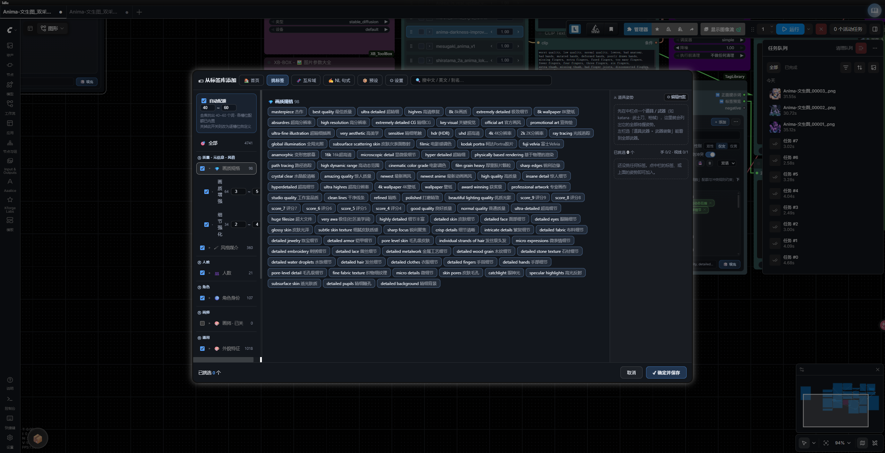
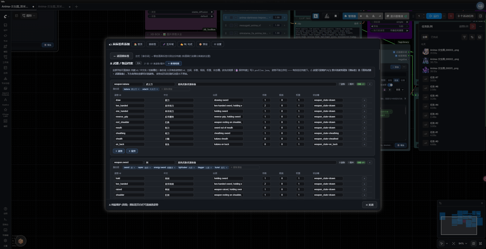

# 🏷 ComfyUI-TagLibrary

[中文文档](README.md) | **English**

Structured tag-library node: assembly axes + weapon & object profile bundles + resource-budget conflict engine + natural-language tail.
12 axes / 66 slots / 4458 tags / 18 weapon & object profiles / 50 mutex domains / 36 NL sentence families.
Outputs `STRING` (tag body + optional English NL tail) — just Convert to Input on any workflow's `CLIPTextEncode.text`. 1-4ms per generation.

  

## Core Architecture (four pillars)

- **Assembly axes**: the real skeleton of the library is not a 2-level tree — all 4458 tags are re-aggregated onto 12 axes (quality / headcount / identity / appearance / outfit / props & weapons / action / scene …), then grouped into six output sections following the official Anima tag order. The picker is a **single view**: section → axis → slot, each row with an enable toggle (off = written to exclusions, the whole row is skipped when rolling).
- **Weapon & object profiles (⚔ bundles)**: 18 profiles (katana/sword/greatsword/gun/bow/staff/polearm + phone/book/umbrella/guitar/cup/camera/…) carry pose bundles: each pose = tag group + hands + gaze + state slot + exclusions. **A rolled weapon always births with a grip pose; a pose never appears without its weapon** — naked weapons, two-handed katanas and bow-pose-carrying-guns are structurally impossible (10k-seed stress: 100% bundle birth rate).
- **Resource-budget conflict model**: same-axis/same-group mutex + hands/gaze ledgers + state slots + 50 global mutex domains (🧬 inspectable & editable) derive conflicts structurally; cross-pool rules live on in `conflicts.json`. Gender lock and mouth-domain double-occupation are enforced at pool level AND exit level.
- **Natural-language tail (✍ NL)**: after the tag body, 1-4 English sentences compiled from 36 table-driven families (pronoun anaphora / sentence rotation / narrative order — three anti-stitch laws). Zero LLM on the hot path, seed-deterministic, toggleable in ⚙ Settings.

## Features

- **In-node panel**: drag-to-reorder, 📌 pinning, bilingual EN/中文, NSFW toggle, gender filter (⚥/♀/♂); 🎲 fill calls the server-side `/taglib/api/draw` — the exact engine the node executes, so preview ≡ output
- **Two modes**
  - `Manual` — pick by hand, or 🎲 fill with a fresh roll
  - `Auto` — every generation rolls a fresh combination; the echo only replaces engine-rolled tags, manual picks are never wiped
- **➕ Add Tags picker (5 tabs)**: Pick / ⚔ Profiles / 🧬 Mutex domains (incl. cross-pool rules) / ✍ NL families / ⚙ Settings; exclusions live in a sidebar drawer with axis/slot/subgroup granularity
- **Artist axis (🎨)**: empty + off by default — artists are *chosen*, not rolled; fill in a name or flip the sidebar toggle when wanted. Names are stored bare and the Anima-required `@` prefix is added on output
- **Profile visualization**: per-card identity tags, full pose table (tags / hands / state slot / exclusions), mount diagnostics badge (unmounted weapon words flagged), all fields editable inline, JSON editor with instant save
- **Standalone manager page**: `http://127.0.0.1:8188/taglib` or the 🏷 topbar button — full CRUD, custom icons, chip flow, batch paste import, full-text search
- **NSFW tiers**: explicit tags shown in red, gated for display and output
- **Folder-based storage (hot sync)**: the library IS a folder tree (`axis/slot/slot.md`), synced both ways in real time; one-way / two-way deletion switchable
- **AI collaboration loop**: export templates (basic/full/conflicts), extend with your AI, import back with auto-placement, dedupe and confirm preview
- **Backup**: 💾 Save as Default / ↺ Restore Backup / 🗑 Clear Library (optionally exporting the full template first)
- **Pin semantics**: 📌 pinned tags always survive rolls and echoes; pinned weapons birth with bundles too
- **Generation metadata**: PNG info carries a `TagLibrary` chunk (node / mode / seed / actual prompt), reproducible per seed
- **Translator immunity**: tag English is never rewritten by ComfyUI-DD-Translation or similar
- **Performance**: 1-4ms per execution; p50 <3ms for a 10k-tag snapshot build; manual-mode en/id lookups cached per library revision
- **Seed determinism**: same seed → same output; weight syntax `(tag:1.2)`, order-preserving dedupe, prefix/suffix concat

## UI Preview

| Picker single view (section → axis → slot, ⚔ bundle chips) | Weapon & object profiles (pose tables / mount diagnostics / inline editing) |
|---|---|
|  |  |

| Node panel (pick / 🎲 fill / NSFW toggle) | Library manager (CRUD / import-export / backups) |
|---|---|
|  |  |

## Installation

### Option 1: ComfyUI Manager search (recommended)

1. Manager icon → **Custom Nodes Manager**
2. Search **`Tag Library`** (or `taglibrary`) → find "🏷 Tag Library 标签库" → **Install**
3. Restart ComfyUI when prompted

> If it doesn't show up, refresh the node database cache in Manager (or restart ComfyUI) and search again.

### Option 2: Install via Git URL

```
https://github.com/WSYXIUBA/ComfyUI-TagLibrary
```

### Option 3: Git clone

```bash
cd ComfyUI/custom_nodes
git clone https://github.com/WSYXIUBA/ComfyUI-TagLibrary
```

Restart ComfyUI. No pip dependencies.

## Quick Start

1. Double-click the canvas, search "🏷 Tag Library"
2. Right-click `CLIPTextEncode.text` → **Convert to Input** → connect `positive`
3. Hit **➕ Add Tags**: pick tags / browse profiles / tune mutex & NL / settings
4. `Manual`: pick or 🎲 fill. `Auto`: just Queue — every run rolls anew
5. Wire `tags_preview` to a Preview Text node to inspect output

## Node Interface

| In/Out | Notes |
|---|---|
| `mode` | manual / auto |
| `seed` | same seed, same output |
| `selection_state` | panel state (auto-maintained, don't hand-edit) |
| `prefix` / `suffix` (optional inputs) | upstream text concatenated around the tags |
| `positive` output | tags + NL tail → CLIPTextEncode |
| `tags_preview` output | actual text preview → Preview Text |

## Data Files

| File | Notes |
|---|---|
| `data/default/tag_library.json` | factory default library (updated with the plugin) |
| `data/default/tag_library.user.json` | user snapshot (survives upgrades) |
| `data/default/taglib/` | folder-style library (hot sync, `axis/slot/slot.md`) |
| `data/default/taglib/profiles.json` | weapon & object profiles (bundles / resources / state slots / NL) |
| `data/default/taglib/grouprules.json` | global mutex domains (50 groups) |
| `data/default/taglib/nl_flavors.json` | NL families (36 families + pose_map + object pools) |
| `data/default/taglib/conflicts.json` | cross-pool rules (kept for compatibility) |
| `data/default/backups/` | backups |

## Conflict Model

| Mechanism | Example | Source of truth |
|---|---|---|
| Same-axis / same-group mutex | `smile` blocks `grin` | `axis` / `groups` in library |
| Global mutex domains | mouth: `cigarette in mouth` ⊄ `food in mouth` | `grouprules.json` |
| Resource budget | hands ≤ 2, gaze ≤ 1 — umbrella + two-handed cup is structurally impossible | `profiles.json` |
| State slots | one weapon can't be `drawn` and `sheathed` at once | `profiles.json` |
| Cross-pool rules | photorealism ⊄ anime-style | `conflicts.json` |
| Gender lock | with `1boy`, `1girl/milf/witch` blocked at pool + exit | gender flags |

## Tests

```bash
python tools/run_gates.py               # 12 offline gates
python tools/run_gates.py --with-online # + 4 gates that need a running ComfyUI
python tools/run_gates.py --list
python tools/run_gates.py m1 m3         # run a subset
```

Offline gates (12): engine core, weapon bundles, NL compiler, object profiles, 30-prompt audit,
backend smoke chain, conflict engine, folder hot-sync, .md parser, perf build,
output quality (word band / quotas / mutex / count / malformed / section order / NSFW round-trip),
full-prompt heavy test.

Online gates (4, need a running ComfyUI; `ui_*` also need Edge remote debugging on 9222):
real HTTP queue acceptance, real-node output test (60 generations × text-level asserts),
browser UI walkthrough (screenshots + asserts incl. default-mode setting), theme consistency.

> `tests/_scratch/` is an archive of one-off diagnostic scripts, not part of the gates.
> CI: `.github/workflows/gates.yml` (offline gates only).

## Changelog

Full version history in [CHANGELOG.md](CHANGELOG.md) (Chinese). Current: **v1.6.5**.

## License

MIT
